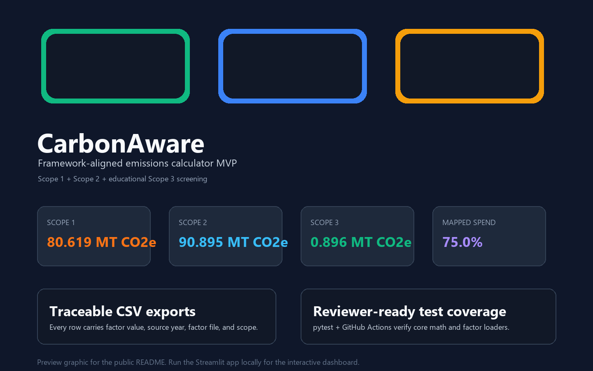

# Framework-Aligned Emissions Calculator (CarbonAware MVP)


A local-first greenhouse gas emissions calculator that turns facility activity data into transparent Scope 1, Scope 2, and educational Scope 3 screening estimates.

This prototype is designed around the **Greenhouse Gas Protocol Corporate Accounting and Reporting Standard** boundary concepts, separating direct operational emissions (Scope 1), indirect purchased-energy emissions (Scope 2), and an educational spend-based Scope 3 screening workflow. It is not a compliance or certification system.

---

> [!WARNING]  
> **Mandatory Disclosure & Compliance Disclaimer**  
> “This prototype is intended for learning, portfolio demonstration, and early facility screening. It is not a certified greenhouse gas inventory tool. Emission factors, organizational boundaries, market-based Scope 2 claims, renewable energy certificates, and reporting requirements must be reviewed against current guidance before formal reporting.”

---

## 📖 Table of Contents
1. [Preview](#-preview)
2. [Reviewer Start Here](#-reviewer-start-here)
3. [Core Features](#-core-features)
4. [Accounting Framework & Methodology](#-accounting-framework--methodology)
5. [Project Directory Architecture](#-project-directory-architecture)
6. [Quick Start](#-quick-start)
7. [Installation & Setup Guide](#-installation--setup-guide)
8. [Running the Application](#-running-the-application)
9. [Executing the Test Suite](#-executing-the-test-suite)
10. [Example Data](#-example-data)
11. [Operational Assumptions & Boundaries](#-operational-assumptions--boundaries)
12. [Emission Factors Reference Guide](#-emission-factors-reference-guide)
13. [Future Roadmap & Architectural Enhancements](#-future-roadmap--architectural-enhancements)

---

## 🖼️ Preview



---

## 🔎 Reviewer Start Here

If you are reviewing this repository quickly:

1. Read the mandatory disclaimer above.
2. Review `data/emission_factors.json` and `data/scope3_supply_chain_factors.json`.
3. Inspect `src/emissions_calculator/calculator.py` for Scope 1/2 logic.
4. Inspect `src/emissions_calculator/scope3_calculator.py` for Scope 3 spend-based screening.
5. Run `python -m pytest tests/ -q`.
6. Launch the Streamlit app with `python -m streamlit run app.py`.
7. Test `examples/sample_facility_inputs.csv`.
8. Test `examples/sample_scope3_purchases.csv`.

For a concise portfolio explanation, see `docs/portfolio-summary.md`.

---

## 📖 Detailed Table of Contents
1. [Core Features](#-core-features)
2. [Accounting Framework & Methodology](#-accounting-framework--methodology)
3. [Project Directory Architecture](#-project-directory-architecture)
4. [Quick Start](#-quick-start)
5. [Installation & Setup Guide](#-installation--setup-guide)
6. [Running the Application](#-running-the-application)
7. [Executing the Test Suite](#-executing-the-test-suite)
8. [Example Data](#-example-data)
9. [Operational Assumptions & Boundaries](#-operational-assumptions--boundaries)
10. [Emission Factors Reference Guide](#-emission-factors-reference-guide)
11. [Future Roadmap & Architectural Enhancements](#-future-roadmap--architectural-enhancements)

---

## 🌟 Core Features

- **Decoupled Backend Engine**: Calculation math, factor loaders, schema validations, and types are isolated inside a standalone Python package (`src/emissions_calculator`), achieving modular unit-testability outside the GUI.
- **Glassmorphism Metrics Dashboard**: Premium, highly-responsive frontend designed with Streamlit, custom Outfit typography, dynamic card visual transitions, and metric highlights.
- **Interactive Visualizations**: Rich, hover-responsive plotly donut and horizontal bar charts mapping scope shares and resource breakdowns.
- **Bulk CSV Upload & Batch Processing**: Runs carbon accounting formulas instantly across multiple facilities via CSV batch uploads, compiling comparative bar charts and downloadable master inventories.
- **Structured Data Model**: Every conversion factor is loaded from a structured JSON schema detailing year, source, and provenance metadata to support transparent calculations and clear review notes.

---

## 🧮 Accounting Framework & Methodology

The application applies the core operational carbon formulation:

$$\text{Activity Data} \times \text{Emission Factor} = \text{Greenhouse Gas Emissions (MT } CO_2e)$$

### Why Scope Separation Matters
To avoid **double-counting** and establish clear organizational boundaries:
- **Scope 1 (Direct Emissions)**: Generated by onsite combustion owned or controlled directly by the facility. For example, burning **Natural Gas** for commercial heating or consuming **Diesel Fuel** in generators or company-owned fleet vehicles.
- **Scope 2 (Indirect Emissions)**: Generated by utilities consumed by the facility but combusted offsite by the power generator. In this application, this represents **Purchased Electricity** from the regional power grid.

---

## 📂 Project Directory Architecture

The repository is organized following clean, professional python packaging standards:

```text
framework-aligned-emissions-calculator/
  ├── .github/
  │   └── workflows/
  │       └── tests.yml             # GitHub Actions pytest workflow
  ├── README.md                     # Deep technical documentation and user guide
  ├── requirements.txt              # Standard package dependency list
  ├── app.py                        # Streamlit dashboard and user interface
  ├── data/
  │   ├── emission_factors.json     # Local database of Scope 1/2 conversion factors and citations
  │   └── scope3_supply_chain_factors.json # Small educational subset of EPA Supply Chain v1.2 factors
  ├── docs/
  │   ├── portfolio-summary.md      # Reviewer-oriented project summary
  │   └── images/
  │       └── dashboard-preview.png # README dashboard preview image
  ├── src/
  │   └── emissions_calculator/
  │       ├── __init__.py           # Package interfaces exposure
  │       ├── calculator.py         # Carbon math, input validation, and scope aggregations
  │       ├── models.py             # Struct data models for factors and results
  │       ├── factors.py            # JSON factor loader and validator
  │       ├── scope3_models.py      # Struct data models for Scope 3 spend-based items
  │       ├── scope3_factors.py     # JSON loader and validator for Scope 3
  │       └── scope3_calculator.py  # Scope 3 spend-based calculations and warnings
  ├── tests/
  │   ├── test_calculator.py        # Pytest coverage for core math, bounds, and scope rules
  │   ├── test_factors.py           # Pytest coverage for factor parsing and failures
  │   └── test_scope3.py            # Pytest coverage for Scope 3 loaders and warning models
  └── examples/
      ├── sample_facility_inputs.csv # Reference CSV format for multi-facility uploads
      └── sample_scope3_purchases.csv # Reference CSV format for Scope 3 purchase-ledger uploads
```

---

## ⚡ Quick Start

For a fast local check after cloning:

```powershell
python -m venv .venv
.venv\Scripts\Activate.ps1
python -m pip install -r requirements.txt
python -m pytest tests/ -q
python -m streamlit run app.py
```

On Linux/macOS, activate the virtual environment with:

```bash
source .venv/bin/activate
```

---

## ⚙️ Installation & Setup Guide

### Prerequisites
- **Python 3.9+** (Tested with Python 3.13)
- Windows PowerShell, Command Prompt, or Unix Shell

### Step-by-Step Setup
1. **Navigate to the Project Root**:
   ```powershell
   cd framework-aligned-emissions-calculator
   ```

2. **Initialize a Local Virtual Environment**:
   ```powershell
   python -m venv .venv
   ```

3. **Activate the Virtual Environment**:
   - **Windows (PowerShell)**:
     ```powershell
     .venv\Scripts\Activate.ps1
     ```
   - **Windows (Command Prompt)**:
     ```cmd
     .venv\Scripts\activate.bat
     ```
   - **Linux/macOS**:
     ```bash
     source .venv/bin/activate
     ```

4. **Install Dependencies**:
   ```powershell
   python -m pip install -r requirements.txt
   ```

---

## 🚀 Running the Application

Launch the interactive local server using Streamlit:

```powershell
streamlit run app.py
```

Upon launching, the command prompt will output a local network address (typically `http://localhost:8501`). Open your browser to access the dashboard.

---

## 🧪 Executing the Test Suite

Our unit tests cover core math, negative input rejection, missing factor failures, scope boundary checks, and empty input handling.

Execute the tests inside the virtual environment:

```powershell
python -m pytest tests/ -v
```

---

## 🧾 Example Data

Two example files are included for manual testing:

| File | Purpose |
| :--- | :--- |
| `examples/sample_facility_inputs.csv` | Scope 1 and Scope 2 multi-facility utility/fuel upload |
| `examples/sample_scope3_purchases.csv` | Scope 3 Category 1 purchase-ledger upload with one intentionally unmapped row |

The unmapped Scope 3 row is intentional. It demonstrates how the app separates mapped spend from unmapped spend instead of silently treating missing factor coverage as complete.

---

## 📋 Operational Assumptions & Boundaries

- **Stationary Combustion**: Natural gas and diesel factors are calculated under the stationary combustion boundary. Mobile combustion parameters are ignored.
- **Generic Grid-Average Scope 2**: Grid electricity calculations currently utilize a generic US national average factor (Location-based method) as a baseline. This is a simplified approach; true Scope 2 location-based accounting requires regional grid factors reflecting specific geographic subregions (e.g., eGRID subregions). Transitioning to dynamic, regional eGRID subregion lookup is planned as a high-priority future roadmap enhancement. **Market-based methods** (accounting for RECs, green utility purchasing contracts, or local solar attributes) are omitted.
- **Global Warming Potentials**: Equivalence conversions utilize standard IPCC 5th Assessment Report (AR5) 100-year GWP indices ($CO_2 = 1, CH_4 = 28, N_2O = 265$).
- **Spend-Based Scope 3 Screening**: Supply-chain calculations are designed to provide **provenance-friendly, educational screening estimates** utilizing high-level procurement registers and spend indexes. They do not represent supplier-specific primary-data accounting. Procurement amounts are multiplied by standard **SEF+MEF** (Supply Chain Emission Factor + Margins Emission Factor) values to capture complete lifecycle margins. Values utilize 2019 environmental baselines expressed in 2021 USD (model version: EPA Supply Chain Factors v1.2); inflation adjustments and direct supplier primary carbon reporting represent future roadmap items. The included Scope 3 factor file is a small demonstration subset, not the full EPA NAICS factor library.

---

## 📚 Emission Factors Reference Guide

Active Scope 1 and Scope 2 factors are stored in `data/emission_factors.json`:

| Fuel/Activity Type | Boundary | Input Unit | MT $CO_2e$ / Unit | Primary Source Citation |
| :--- | :--- | :--- | :--- | :--- |
| **Natural Gas** | Scope 1 | therms | `0.005306` | EPA Greenhouse Gas Emissions Factors Hub (2023) |
| **Diesel Fuel** | Scope 1 | gallons | `0.010210` | EPA Greenhouse Gas Emissions Factors Hub (2023) |
| **Electricity** | Scope 2 | kWh | `0.000371` | EPA eGRID National Average Grid Rate (2023) |

Scope 3 spend-based factors are stored separately in `data/scope3_supply_chain_factors.json`. The current project includes only a small educational subset of EPA Supply Chain GHG Emission Factors v1.2 categories for demonstration and testing. It should not be treated as a complete supply-chain factor library.

The Scope 1/2 factors currently use 2023-era default values. Before formal reporting, factor versions should be reviewed against the latest available EPA GHG Emission Factors Hub and eGRID releases.

---

## 🗺️ Future Roadmap & Architectural Enhancements

- [ ] **EPA eGRID Regional Subregion Lookup**: Dynamically look up electricity emission factors based on zip codes or eGRID subregion codes rather than national averages.
- [ ] **Market-Based Scope 2 Accounting**: Implement dual-reporting capabilities tracking both location-based grid average factors and custom supplier-specific emission rates or REC purchases.
- [ ] **Monthly Utility Bill Integration**: Transition from annualized activity estimates to monthly tracking calendars to capture seasonality trends.
- [ ] **Expanded Scope 3 Boundaries**: Extend beyond Category 1 purchased goods and services to employee commuting, business travel, and transportation categories.
- [ ] **Source URLs in Factor Metadata**: Add direct source URLs to factor JSON and include them in detailed exports where practical.
- [ ] **Calculation Audit Log**: Automatically append date stamps, user credentials, and active system version tags to exported CSV summaries.
- [ ] **Uncertainty Quantification**: Provide margin-of-error indicators based on factor variations and data quality scores.
